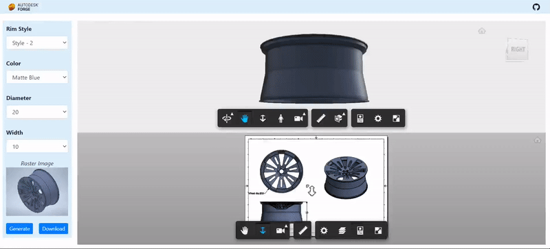

# forge-rimconfigurator-inventor

# Description

Web application that demonstrates the use of Inventor Design Automation and iLogic capabilities to create a configuration tool. Updates the model according to the selected configuration and generates the corresponding drawing file and displays them using the Viewer. The result file can then be downloaded in 3 formats, viz. IPT, IDW and PDF.

## Thumbnail

# Setup

## Prerequisites

1. **Forge Account**: Learn how to create a Forge Account, activate subscription and create an app at [this tutorial](http://learnforge.autodesk.io/#/account/). 
2. **.NET Core** basic knowledge with C#
3. **ngrok**: Routing tool, [download here](https://ngrok.com/). 

## Running locally

Clone this project or download it. It's recommended to install [GitHub desktop](https://desktop.github.com/). To clone it via command line, use the following (**Terminal** on MacOSX/Linux, **Git Shell** on Windows):

    git clone https://github.com/sajith-subramanian/forge-rimconfigurator-inventor
    
**ngrok**

When a `Workitem` completes, **Design Automation** can notify our application. As the app is running locally (i.e. `localhost`), it's not reachable from the internet. `ngrok` tool creates a temporary address that channels notifications to our `localhost` address.

After downloading [ngrok](https://ngrok.com/), run `ngrok http 3000 -host-header="localhost:3000"`, then copy the `http` address into the `FORGE_WEBHOOK_URL` environment variable. For this sample, do not use the `https` address.

# Further Reading

Documentation:

- [Design Automation v3](https://forge.autodesk.com/en/docs/design-automation/v3/developers_guide/overview/)
- [Learn Forge Tutorial](https://learnforge.autodesk.io/#/tutorials/modifymodels)

Other APIs:

- [.NET Core SignalR](https://docs.microsoft.com/en-us/aspnet/core/signalr/introduction?view=aspnetcore-2.2)

## License

This sample is licensed under the terms of the [MIT License](http://opensource.org/licenses/MIT). Please see the [LICENSE](LICENSE) file for full details.

## Written by

Sajith Subramanian, [Developer Advocacy and Support](http://forge.autodesk.com)
